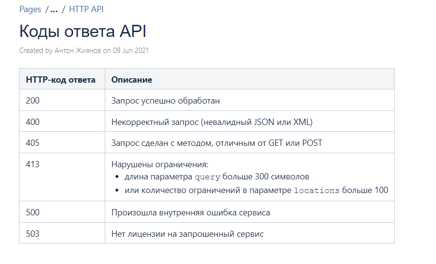
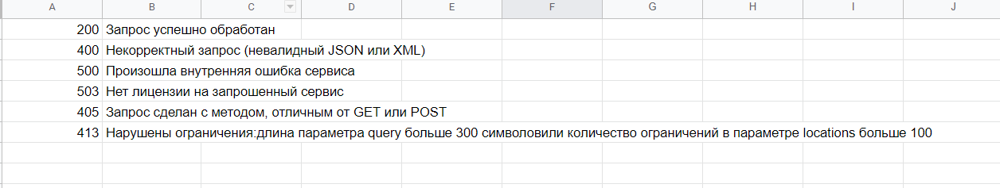

# html-parser

Консольное приложение, которое парсит таблицу с данными в указанном HTML и заполняет эти данные в Google Таблицу.

Присутсвует синхронизация с HTML файлом в виде:
- При изменении HTML документа, при запуске данного приложения данные автоматически обновятся в Google таблице
- Поддерживает Добавление, Изменение, Удаление в HTML таблице

В приложении используются пакеты:

- [viper](github.com/spf13/viper) для работы с конфигурационными файлами
- [spreadsheet.v2](gopkg.in/Iwark/spreadsheet.v2) для взаимодействия с Google Doc API
- [colly](github.com/gocolly/colly/v2) для парсинга HTML файлов

## Скриншоты:
C данной HTML таблицы парсятся данные:

и заносятся в Google таблицу:
